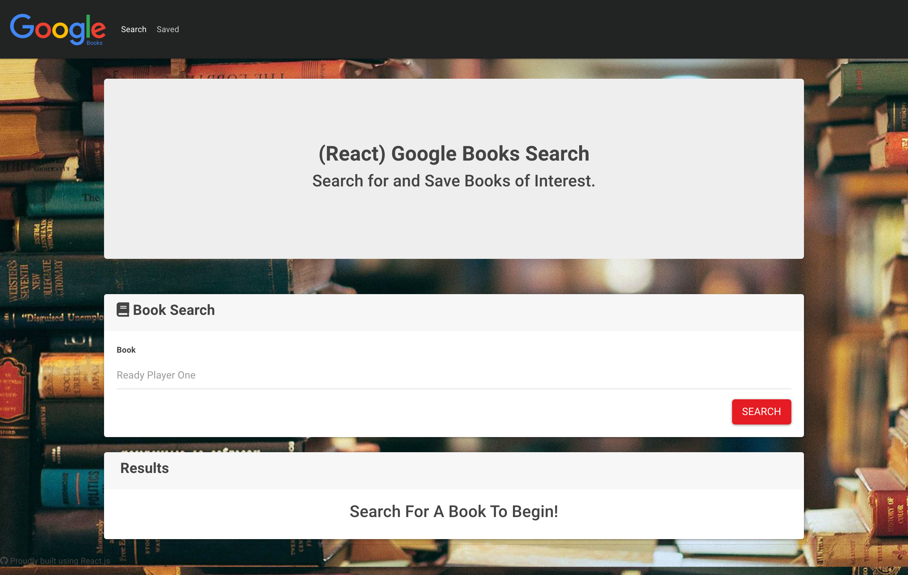

# Google Books Search

## Description 
This React-based Google Books Search application is the perfect tool for anyone who reads books. This MERN application utilizes the React lifecycle methods to query and display books based on the users searches. The application also use Node, Express and MongoDB so that users can save books to review or purchase later.

## Table of Contents  
* [Installation](#installation)
* [Usage](#usage)
* [License](#license)
* [Contributing](#contributing)
* [Questions](#questions)
* [Links](#links)

## Installation
This generator requires the user to install dependencies using the command "npm i" in their terminal. After installation to run the application, run "npm start" from your server.

## Usage 
To start, in the "Book Search" container type in a book you would like to search for, then press the "SEARCH" button.

After you search for a book, you will see the search results in the "Results" container. Here you can "VIEW", which will direct you to the Google Play store where you can get more information on the book and purchase the book. Another option you have in the "Results" container is to "SAVE" which will save the book for you to look back on later under the "Saved" page.

On the Saved page, in the "Saved Books" container, you can see a list of books you saved for later. You can "VIEW", which like before will direct you to the Google Play store. You can also "DELETE" the book from your saved books list. 

## License
This project is licensed under the MIT license.

## Contributing
To contribute to this project you can fork this GitHub repository.

## Questions
If you have any additional questions about this application you can reach out to me at briannahebeler@gmail.com.
You can check out some of my other projects at briannahebeler (https://github.com/briannahebeler).

## Links

* Github Link: https://github.com/briannahebeler/google-books-search

* Deployed Link: https://google-books-search-briheb.herokuapp.com/